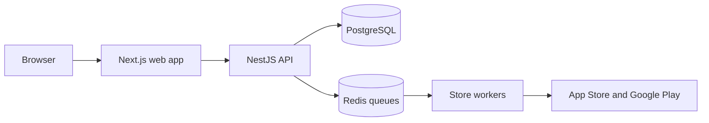

asobeast is a Next.js frontend, a NestJS API, PostgreSQL for durable state and Redis for queues. Every store request is made from the machine that hosts the deployment, never from your browser and never from a service asobeast operates.

## What is the request path?

A browser request never reaches the API directly in the production Compose stack.

1. The browser calls `/api/backend/*` on the web origin, the same origin it signed in to.
2. The Next.js route handler proxies that request to `API_INTERNAL_URL`, which Compose sets to `http://api:4000`.
3. The API authenticates the session cookie or the `asob_` bearer token, authorizes the request and answers.

Because the browser and the API share an origin, there is no CORS configuration and no cross site cookie handling. `API_PROXY_TIMEOUT_MS` bounds each proxied request, and a request that exceeds it returns a `504` error envelope instead of hanging.

Server rendered pages skip the proxy and call `API_INTERNAL_URL` directly, which is why the same variable serves both paths.

## What are the five surfaces?

| Surface | What it is | Who reaches it |
| --- | --- | --- |
| Web app | The Next.js dashboard on port 3000 | Anyone with an account |
| HTTP API | The NestJS API behind the proxy | Sessions and personal API tokens |
| Remote MCP endpoint | `POST /mcp` inside the API, read only | An agent holding a personal API token |
| Local MCP server | A read only stdio process over the HTTP API | An agent on your machine |
| Admin surfaces | The queue dashboard and the OpenAPI surface | The owner account only |

Both MCP surfaces register one catalog of tool definitions and serve MCP `2026-07-28` alongside the 2025 revisions. The remote endpoint builds one server instance per request and holds nothing between requests, which is no longer a transport setting but a property of the protocol: `2026-07-28` has no sessions to hold. See [The asobeast MCP server](/mcp/introduction).

## Why is store collection isolated?

Every store request goes through the `StoreProvider` interface in `apps/api/src/store-providers/`. No other module may import a scraper library.

That single rule contains a parser breakage to one file. When Apple or Google change a response shape, one provider module fails and the rest of the application keeps serving requests. It also keeps rate limiting in one place, and it leaves room for a future deployment to swap in proxies or a data API without touching product code.

Raw scraper payloads are stored in `raw` JSON columns. Parsers change, so keeping the original response means a corrected parser can reprocess history without collecting it again.

## How does work run in queues?

Collection runs in two BullMQ workers, one per store, both at concurrency 1 behind a rate limiter.

| Worker | Queue | Limiter |
| --- | --- | --- |
| `appstore` | Apple jobs | `SCRAPE_ITUNES_RPM`, default 15 per minute |
| `gplay` | Google Play jobs | `SCRAPE_GPLAY_RPM`, default 10 job starts per minute |

A parse failure fails the job. BullMQ retries it with backoff, and request handling is never affected. See [The daily pipeline and rate limits](/concepts/pipeline).

## The component graph

The browser talks only to the Next.js web app, which proxies to the NestJS API. The API reads and writes PostgreSQL for durable state and enqueues work in Redis. The store workers drain those queues and are the only components that reach the App Store and Google Play endpoints.

## Where do types live?

Every request and response shape the frontend consumes is defined in `@asobeast/shared`, for example `AppListItem`, `TrackedKeywordItem`, `AppSummary`, `RankingSeries` and `ApiErrorEnvelope`.

| Package | Role |
| --- | --- |
| `@asobeast/shared` | Contract types, the `Store` union, the store URL parser, normalization helpers |
| `apps/api` | DTO classes that implement the shared interfaces |
| `apps/web` | Types every fetch call with the shared contracts |
| `apps/mcp` | A consumer like the web app, over HTTP only |
| `@asobeast/mcp-tools` | The one tool catalog both MCP surfaces register |

Prisma generated types never cross the `apps/api` boundary, so the web app and the MCP server stay independent of the database. `@asobeast/shared` is compiled with tsup to CommonJS, ESM and type declarations, because the NestJS CommonJS build cannot consume a just in time TypeScript package cleanly.
