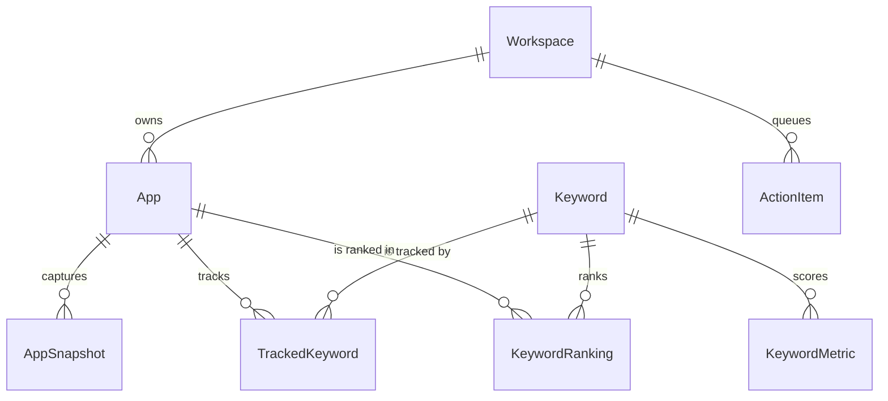

An app is one row with a home storefront. Keywords are separate rows scoped by text, store and country, and a join table connects the two. That shape is what lets a single app track keywords in many markets without duplicating the app.

## Entities

| Entity | Purpose | Key rule |
| --- | --- | --- |
| `Workspace` | The tenant boundary | One seeded default workspace in v1 |
| `User` | An account with a role and a plan | Email is unique. The first account bootstraps as owner |
| `ApiToken` | A revocable personal API token | Stored as a SHA-256 hash, never as plaintext |
| `AppGroup` | A linked group of listings across stores | Unique on group and store, so a group holds one app per store |
| `App` | One tracked listing | Unique on workspace, store, store app id and country |
| `AppSnapshot` | A captured copy of the listing metadata | Keeps the raw payload for reprocessing |
| `Keyword` | A phrase in one store and one storefront | Unique on `text`, `store`, `country` |
| `TrackedKeyword` | The link between an app and a keyword | Keyed on app and keyword, carries `source` and `relevance` |
| `KeywordMetric` | Persisted traffic and difficulty for a day | Keyed on keyword and date |
| `KeywordRanking` | One position observation | Keyed on app, keyword and date. Carries `depth` |
| `SerpEntry` | One search result row for a keyword and day | Keyed on keyword, date and position |
| `CategoryRank` | A free, paid or grossing chart position | Keyed on app, date, collection and genre |
| `Review` | A synced store review | Unique on app and store review id |
| `ChangeEvent` | A detected metadata change | Covers owned and competitor apps |
| `AuditScore` | A daily audit score snapshot | Keyed on app and date |
| `ActionItem` | One Action Center recommendation | Unique on workspace and fingerprint |
| `Webhook`, `EmailAlert` | Alert subscriptions | Deliveries are logged per channel |

## How do they relate?

A workspace owns apps. Each app captures snapshots of its listing and tracks keywords through a join table, because the same keyword row is shared by every app that tracks it. Traffic and difficulty attach to the keyword, while a position attaches to the pair of an app and a keyword on a given date. Action items belong to the workspace.

## Rules that are easy to get wrong

- **An app is one row.** Countries live on keyword tracking, not on a second app row. See [Countries and markets](/concepts/countries).
- **`Keyword` is unique on `text`, `store` and `country`.** The same phrase tracked in two markets is two keyword rows checked by two searches.
- **A competitor is an app row too.** It carries `isCompetitor` and points at the primary app it was added to.
- **Traffic and difficulty persist in `KeywordMetric`. Opportunity does not persist.** It is computed per app in the read layer. See [Traffic, difficulty and opportunity](/concepts/scoring).
- **`installs` is a `BigInt`** and serializes as a JSON number.
- **All dates are UTC.** Daily granularity uses a PostgreSQL `date` column, and today means the UTC date.
- **Every tenant owned row carries `workspaceId`, and PostgreSQL enforces it.** Each of those tables has a `tenant_isolation` row level security policy, so a query with no workspace in scope returns nothing rather than everything. Service code does not filter by workspace in a `where` clause. `Keyword`, `KeywordMetric` and `SerpEntry` are deliberately global and carry no policy, because one search for a phrase serves every workspace tracking it. What is tenant owned is the tracking relation and the recorded position.

## How does the schema change?

Only forward. Every schema change ships as a forward Prisma migration and the API applies pending migrations on boot. There are no hand written SQL migrations and no down migrations, which is why a rollback is a database restore. See [Upgrade and roll back](/install/upgrade).
